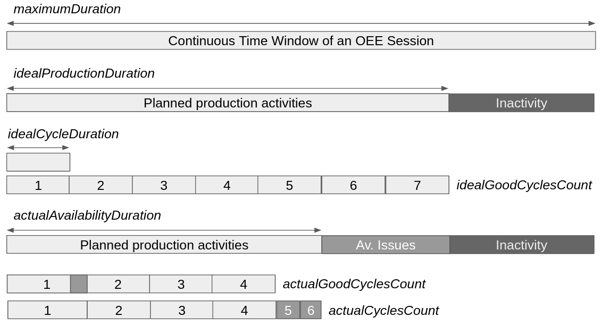

# I40 Submodule for OEE Calculations

## The OEE Index

OEE stands for Overall Equipment effectiveness. 
The Wikipedia contributes a detailed description of the OEE [here](https://en.wikipedia.org/wiki/Overall_equipment_effectiveness)

## Base OEE Calculation

> oee = availability x performance x quality 

## Detailed OEE Calculation Methods 

The methods below are useful examples for systems which aim to implement OEE Calculation Functions based on this model. Despite some attributes to calculate the OEE are method specific, there is a set of first level attributes which are common to all of them. The Figure below summarizes the collection of *core attributes* of the OEE calculation according to this data model.

### OEE Calculation: Method 1
